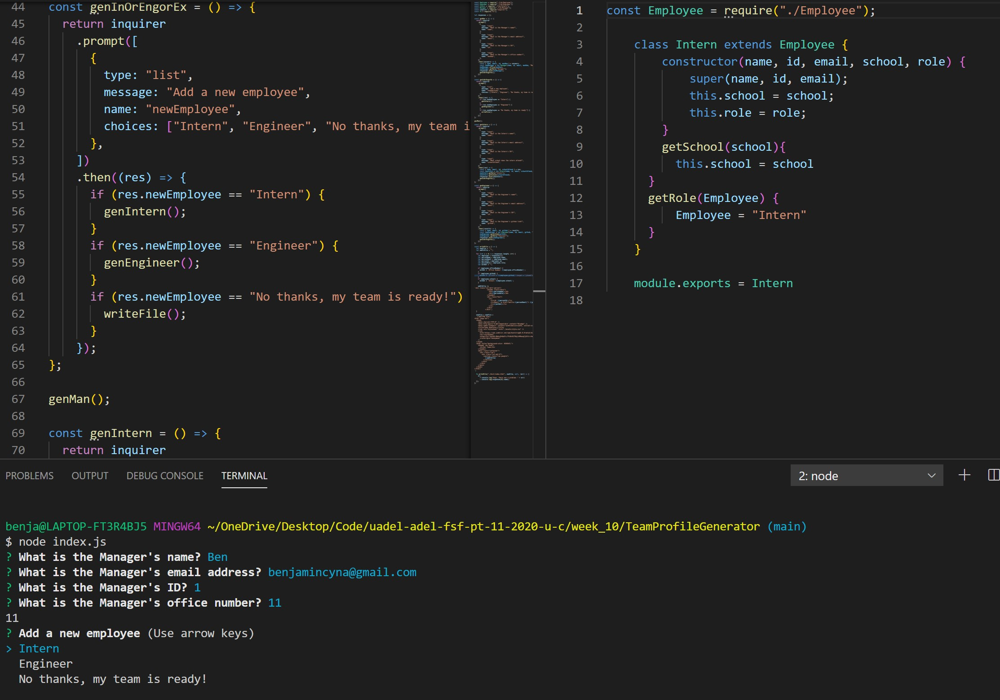

# Team Profile Generator

   [](https://opensource.org/licenses/MIT)

    
   ## Description
   This project utilises consturctor classes and super classes to get user input and display each member of their team to a web-page. Test based development is also used to ensure the classes are returning their expected values    
  
   ## Table Of Contents
   * [Installation](##Installation)
   * [Usage](##Usage)
   * [License](##License)
   * [Contributing](##Contributing)
   * [Tests](##Tests)
   * [Questions](##Questions)
  
   ## Installation
   When the application is run, the user is prompted to provide details for the team manager. After, they are asked to either create an intern, engineer or their team is finished. The user can create as many team memebers as they like. After each team memeber is created, the user is again asked if they'd like to create a new member or to exit the application. When they exit, a html file with built in css is created and each team member is displayed on the web-page. The user input is collected and sorted in classes exported to index.js. An array with their data is used to get each member. Test.js is used for each class to ensure the input matches expected. the inquirer node package is used to generate prompts and the jest package is used to run the tests.
  
   ## Usage
   

   The above code shows ana example of the function genInorEn which allows user to choose to create an intern, engineer or exit the apllication which can be seen live in the root directory at the bottom of the image. To the right is an example of the intern class which uses the super constructor to get all the information about the intern. 

   [Link to example video](https://drive.google.com/file/d/1D7jaPXMe5pSc7NeDOKC4l_Loy4d4ogEo/view)

   ## License
   This project is covered under the MIT License  
      
   ## Contributing
[bencyna](https://github.com/bencyna/)
  
   ## Tests
   Run the following command into the root directory:
             ``` node index.js ```
  
   ## Questions
   If you have any questions about this project, you can veiw my github account at https://github.com/bencyna/ or email me at benjamincyna@gmail.com
   